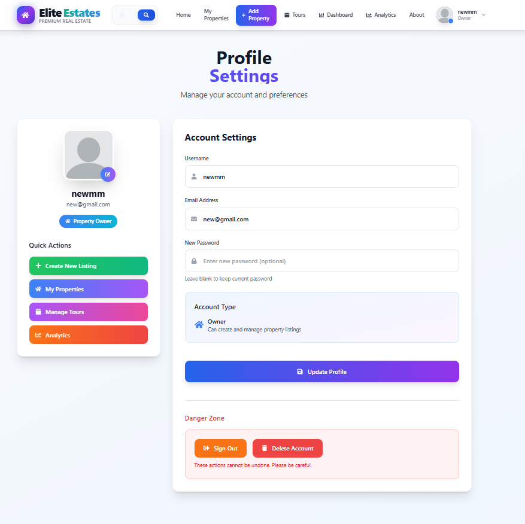
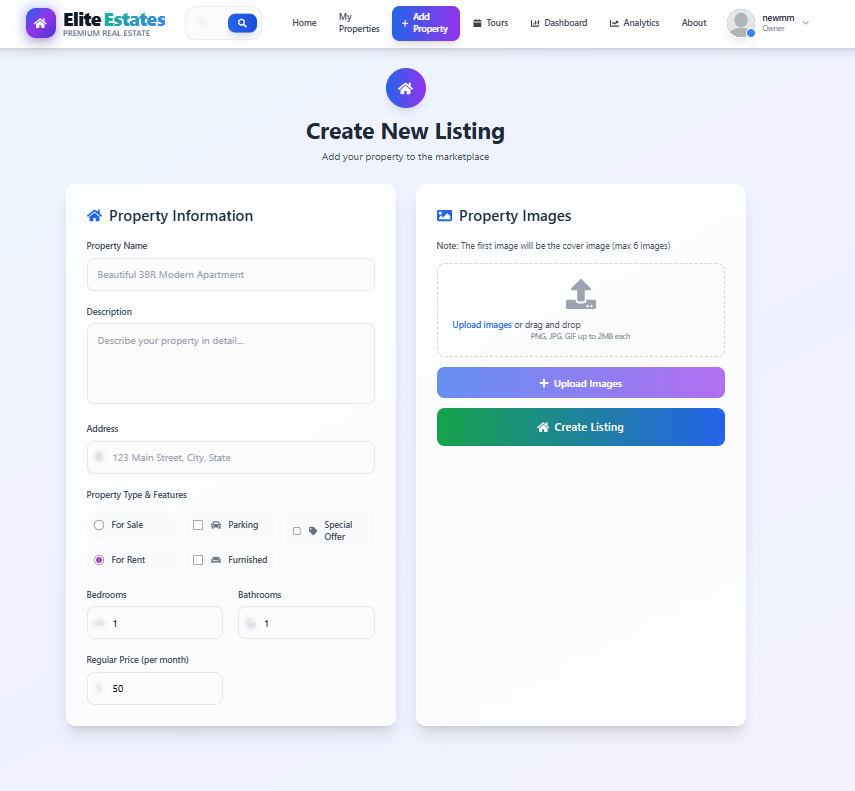
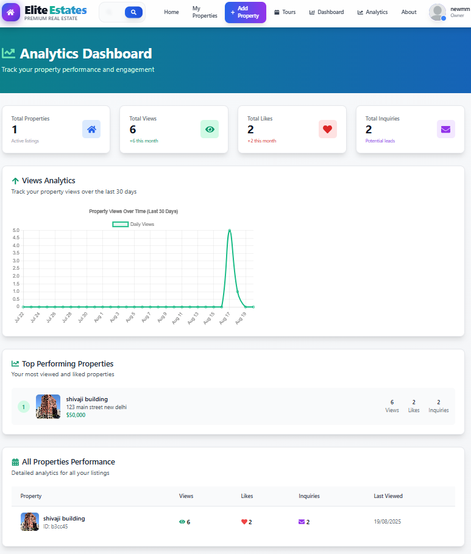

# 🏠 Elite Estates - Modern Real Estate Platform

[](https://opensource.org/licenses/MIT)
[](https://nodejs.org/)
[](https://reactjs.org/)
[](https://www.mongodb.com/)

A comprehensive, modern real estate platform built with the MERN stack featuring advanced search functionality, property management, analytics dashboard, and professional UI design.


## ✨ Features

### 🔐 **Authentication & User Management**
- JWT-based authentication with secure cookie handling
- Google OAuth integration via Firebase
- Role-based access control (User/Admin)
- Profile management with Cloudinary image upload
- Account deletion and data management

### 🏠 **Property Management**
- **Create Listings**: Rich property listing creation with image upload
- **Property Gallery**: Swiper-based image galleries with navigation
- **Advanced Search**: Multi-filter search with price range, location, amenities
- **Property Details**: Comprehensive property information display
- **Favorites System**: Save and manage favorite properties

### 🔍 **Advanced Search & Filtering**
- Real-time search with debouncing
- Multiple filter options (type, price, bedrooms, bathrooms, amenities)
- Location-based search
- Sorting by price, date, and property features
- Pagination with "Load More" functionality

### 📊 **Analytics Dashboard**
- Property listing analytics
- User engagement metrics
- Revenue tracking and insights
- Interactive charts with Chart.js
- Export functionality for reports

### 🎯 **Tour Booking System**
- Schedule property tours
- Tour management dashboard
- Booking confirmation system
- Calendar integration

### 🎨 **Modern UI/UX**
- Glass morphism design with gradient themes
- Responsive design for all devices
- Professional animations and transitions
- Dark/Light theme support
- Accessibility features

### 📱 **Additional Pages**
- About Us with company information
- Contact page with multiple contact methods
- Help Center with FAQ section
- Privacy Policy and Terms of Service
- User-friendly error handling

## 🛠️ Tech Stack

### **Frontend**
- **React 18.3.1** - Modern UI library with hooks
- **Vite** - Fast build tool and development server
- **Redux Toolkit** - State management with Redux Persist
- **React Router** - Client-side routing
- **Tailwind CSS** - Utility-first CSS framework
- **React Icons** - Comprehensive icon library
- **Swiper** - Modern touch slider
- **Chart.js** - Interactive charts and analytics

### **Backend**
- **Node.js** - JavaScript runtime
- **Express.js** - Web application framework
- **MongoDB** - NoSQL database with Mongoose ODM
- **JWT** - JSON Web Token authentication
- **bcryptjs** - Password hashing
- **CORS** - Cross-origin resource sharing

### **Cloud Services**
- **Cloudinary** - Image upload and management
- **Firebase** - Google OAuth authentication
- **MongoDB Atlas** - Cloud database hosting

## 🚀 Quick Start

### Prerequisites
- Node.js (v14 or higher)
- MongoDB (local or Atlas)
- Git

### Installation

1. **Clone the repository**
   ```bash
   git clone https://github.com/Mayankjain2624/real-estate.git
   cd real-estate
   ```

2. **Install dependencies**
   ```bash
   # Install server dependencies
   npm install

   # Install client dependencies
   cd client
   npm install
   ```

3. **Environment Setup**
   
   **Backend Environment (.env):**
   ```bash
   # Copy the example file and fill in your values
   cp .env.example .env
   ```
   
   Edit `.env` with your actual values:
   ```env
   MONGO_STRING=your_mongodb_connection_string
   JWT_SECRET=your_jwt_secret_key
   ACCESS_TOKEN_EXP=2h
   ```

   **Frontend Environment (client/.env):**
   ```bash
   # Copy the example file and fill in your values
   cp client/.env.example client/.env
   ```
   
   Edit `client/.env` with your Firebase API key:
   ```env
   VITE_FIREBASE_API_KEY=your_firebase_api_key
   ```

   **Firebase Configuration:**
   ```bash
   # Copy the example firebase config and update with your values
   cp client/src/firebase.example.js client/src/firebase.js
   ```
   
   Then edit `client/src/firebase.js` with your actual Firebase project configuration.

4. **Start the application**
   ```bash
   # Start backend server (from root directory)
   npm run dev

   # Start frontend server (in a new terminal)
   cd client
   npm run dev
   ```

5. **Access the application**
   - Frontend: `http://localhost:5173`
   - Backend API: `http://localhost:3001`

## 📁 Project Structure

```
real-estate/
├── api/                          # Backend server
│   ├── controllers/              # Request handlers
│   │   ├── auth.controller.js    # Authentication logic
│   │   ├── listing.controller.js # Property management
│   │   ├── user.controller.js    # User operations
│   │   └── analytics.controller.js # Analytics data
│   ├── models/                   # Database schemas
│   │   ├── user.model.js         # User schema
│   │   └── listing.model.js      # Property schema
│   ├── routes/                   # API routes
│   ├── utils/                    # Utility functions
│   └── index.js                  # Server entry point
├── client/                       # Frontend application
│   ├── src/
│   │   ├── components/           # Reusable components
│   │   │   ├── Header.jsx        # Navigation header
│   │   │   ├── Footer.jsx        # Footer component
│   │   │   ├── ListingItem.jsx   # Property card
│   │   │   └── OAuth.jsx         # Google sign-in
│   │   ├── pages/                # Page components
│   │   │   ├── Home.jsx          # Landing page
│   │   │   ├── Search.jsx        # Property search
│   │   │   ├── Profile.jsx       # User profile
│   │   │   ├── Listing.jsx       # Property details
│   │   │   └── AdminPanel.jsx    # Admin dashboard
│   │   ├── redux/                # State management
│   │   └── firebase.js           # Firebase configuration
│   ├── public/                   # Static assets
│   └── package.json              # Frontend dependencies
├── .env                          # Environment variables
├── package.json                  # Backend dependencies
└── README.md                     # Project documentation
```

## 🔗 API Endpoints

### **Authentication**
- `POST /api/auth/signup` - User registration
- `POST /api/auth/signin` - User login
- `POST /api/auth/google` - Google OAuth
- `POST /api/auth/signout` - User logout

### **Property Management**
- `GET /api/listing/get` - Get all listings with filters
- `GET /api/listing/get/:id` - Get single listing
- `POST /api/listing/create` - Create new listing
- `PUT /api/listing/update/:id` - Update listing
- `DELETE /api/listing/delete/:id` - Delete listing

### **User Management**
- `GET /api/user/listings/:id` - Get user listings
- `POST /api/user/update/:id` - Update user profile
- `DELETE /api/user/delete/:id` - Delete user account

### **Analytics**
- `GET /api/analytics/dashboard` - Get analytics data
- `GET /api/analytics/revenue` - Revenue analytics
- `GET /api/analytics/users` - User statistics

## 🎨 UI Features

### **Design System**
- **Glass Morphism**: Modern frosted glass design elements
- **Gradient Themes**: Blue to purple gradient color scheme
- **Responsive Layout**: Mobile-first responsive design
- **Micro-interactions**: Smooth hover effects and transitions
- **Accessibility**: ARIA labels and keyboard navigation

### **Key Components**
- **Search Filters**: Advanced filtering with real-time updates
- **Property Cards**: Interactive property listings with images
- **Image Galleries**: Swiper-based photo carousels
- **Forms**: Modern form design with validation
- **Navigation**: Sticky header with dropdown menus

## 🔐 Security Features

- **Password Hashing**: bcryptjs for secure password storage
- **JWT Authentication**: Secure token-based authentication
- **CORS Protection**: Configured cross-origin resource sharing
- **Input Validation**: Server-side request validation
- **Error Handling**: Comprehensive error management

## 📊 Performance Optimizations

- **Code Splitting**: React lazy loading for reduced bundle size
- **Image Optimization**: Cloudinary integration for optimized images
- **Caching**: Redux Persist for state persistence
- **Debounced Search**: Optimized search performance
- **Pagination**: Efficient data loading with pagination

## 🚀 Deployment

### **Frontend (Vercel/Netlify)**
```bash
cd client
npm run build
# Deploy the dist folder
```

### **Backend (Railway/Heroku)**
```bash
# Set environment variables on your hosting platform
# Deploy the root directory
```

### **Database**
- Use MongoDB Atlas for production database
- Configure connection string in environment variables

## 🤝 Contributing

1. Fork the repository
2. Create your feature branch (`git checkout -b feature/AmazingFeature`)
3. Commit your changes (`git commit -m 'Add some AmazingFeature'`)
4. Push to the branch (`git push origin feature/AmazingFeature`)
5. Open a Pull Request

## 📄 License

This project is licensed under the MIT License - see the [LICENSE](LICENSE) file for details.

## 👤 Author

**Mayank Jain**
- GitHub: [@Mayankjain2624](https://github.com/Mayankjain2624)
- Email: mayankjain2624@gmail.com

## 🙏 Acknowledgments

- React team for the amazing framework
- MongoDB team for the excellent database
- Tailwind CSS for the utility-first CSS framework
- Cloudinary for image management solutions
- Firebase for authentication services

## 📸 Screenshots

### Profile page


### Listing Create


### Admin Dashboard


---

⭐ **Star this repository if you find it helpful!** ⭐

---

**Built with ❤️ by Mayank Jain**
